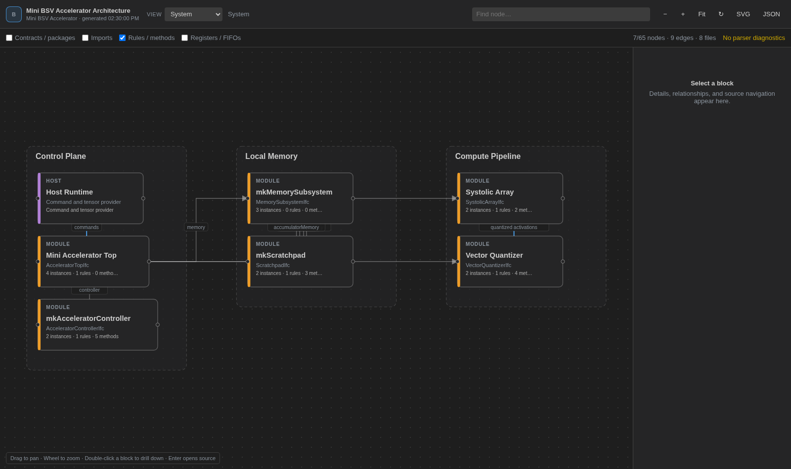

# BSV Architecture Explorer

Bluespec SystemVerilog(`.bsv`) 작업공간을 VS Code 안에서 구조, 데이터 흐름,
rule scheduling 관점으로 탐색하는 오프라인 아키텍처 분석 확장입니다.

- 확장 ID: `code0-god.bsv-architecture-explorer`
- 런타임: CommonJS VS Code Extension + 순수 JavaScript/SVG Webview
- 외부 CDN 및 런타임 npm dependency 없음
- BSC 없이 Source-derived 분석 전체 사용 가능



## 핵심 기능

- Workspace 또는 Current File source scope
- System, Module, Behavior abstraction level
- Structure, Data Flow, Scheduling analysis mode
- 선택 node 기준 1/2/3-hop 또는 All focus
- module별 Interfaces, Methods, Rules, Local Functions, State, Child Instances, Types group
- 접힌 group의 명시적 SVG chevron과 module 요약 count
- 같은 target module의 반복 instance 집계
- interface Method Port category, parameter, return type, 정확한 경우만 width 표시
- Reg/FIFO/Wire/Memory read/write와 interface invocation 방향 분석
- source scheduling attribute와 잠재적 shared-state dependency 구분
- 선택적 BSC schedule provider 및 authoritative badge
- mode/filter를 존중하는 shortest path trace와 다중 path 탐색
- Diagram에서 source 열기 및 editor cursor에서 diagram node reveal
- 관계 종류별 inspector summary, evidence, source 이동
- 검색, pan/zoom, Fit, 자동 refresh, CodeLens, SVG/JSON export
- `.bsv-arch.json` version 1 호환

## 설치

### VSIX

```bash
code --install-extension dist/bsv-architecture-explorer-0.3.0.vsix
```

또는 VS Code에서 **Extensions: Install from VSIX...**를 실행합니다.

### 소스에서 실행

1. 저장소를 VS Code로 엽니다.
2. `F5`로 Extension Development Host를 실행합니다.
3. 개발 호스트에서 BSV 작업공간을 엽니다.
4. **BSV Architecture: Open Workspace**를 실행합니다.

## 네 개의 독립 View 축

### Source Scope

- **Workspace**: 선택한 workspace의 분석 대상 `.bsv` 전체
- **Current File**: 현재 editor 파일에 속한 node만 표시

Source Scope는 파일 범위만 바꿉니다. Level, Mode, hop 계산과 독립입니다.

### Abstraction Level

- **System**: module, resolved module relation, virtual node, configured subsystem 중심.
  method, rule, local function, primitive state node를 처음부터 visible DOM에 만들지 않습니다.
- **Module**: focus module, interface, Method Ports, child instance, storage와 member group.
  Methods, Rules, Local Functions, State는 기본 접힘입니다.
- **Behavior**: rule, method, local function, Reg, FIFO/FIFOF, Wire/RWire,
  BRAM/RegFile와 상세 call/access를 개별 node로 표시합니다.

System module card는 `Instances`, `Methods`, `Rules`, `State` count를 보여줍니다.

### Analysis Mode

- **Structure**: `instantiate`, `implements`, `contains`, `import`, configured structure/control relation
- **Data Flow**: `read`, `write`, `invoke`, `return`, `value`, producer/consumer, manual data relation
- **Scheduling**: conflict, conflict-free, sequential order, mutual exclusion, urgency,
  execution order, preemption, potential state dependency

Mode마다 edge set이 분리됩니다. Structure edge가 Data Flow hop 계산에 섞이지 않습니다.

### Neighborhood Scope

- **1**, **2**, **3**: 현재 Mode edge만 사용하는 undirected neighborhood BFS
- **All**: 현재 활성 component 전체

**Set as focus**로 root를 바꾸면 diagram을 Fit하고 중앙에 배치합니다.
**Back**, breadcrumb, **Clear focus**로 이전 focus를 복원합니다.

## Collapse, instance aggregation, Method Ports

Module level의 group card를 double-click하거나 **Expand group**을 누르면 해당 owner
아래 member만 materialize됩니다. Collapse 상태는 module ID별로 저장됩니다.

같은 owner가 같은 module을 정적으로 여러 번 instantiate하면 `mkModule × 2`처럼
집계합니다. source만으로 수를 확정할 수 없는 경우 `× N`, `parameterized`,
`unresolved multiplicity`를 사용하며 숫자를 추측하지 않습니다.

Method Port는 BSV interface method의 논리적 방향입니다. RTL pin이라는 뜻이 아닙니다.

- `Action`: module이 command/argument를 받음
- pure value method: module이 값을 제공
- `ActionValue#(T)`: request와 result 양방향

각 Method Port tooltip/inspector는 interface, category, parameter, return type,
width status, declaration source를 표시합니다.

## Data Flow 출처

Data Flow는 기본적으로 **Source-derived**입니다. parser가 comment/string을 masking한
source statement에서 다음을 분류합니다.

- Reg read 및 `<=` write
- FIFO `enq`, `deq`, `first`, `clear`, status read
- Wire/RWire read/write
- memory request/response
- interface method invocation
- `<-` ActionValue result binding

모든 inferred edge는 callable, referenced instance, member, statement line,
classification, source snippet evidence를 보존합니다. 분류하지 못한 member access는
`unclassified access`로 남깁니다.

## Scheduling 출처와 정확도

Scheduling 화면은 origin을 숨기지 않습니다.

| Badge / origin | 의미 |
|---|---|
| `SOURCE-DERIVED` / `source-attribute` | source의 명시적 BSV scheduling attribute |
| `HEURISTIC` / `source-heuristic` | 같은 state read/write에서 만든 잠재 dependency |
| `BSC AUTHORITATIVE` / `bsc` | BSC report 또는 확인된 BSC 실행 결과 |
| `MIXED` | 둘 이상의 origin이 함께 존재 |

인식하는 source attribute:

- `descending_urgency`
- `execution_order`
- `mutually_exclusive`
- `conflict_free`
- `preempts`

Shared-state 결과는 항상 `potential-state-dependency`, dashed edge,
`confidence: "potential"`입니다. 실제 compiler conflict로 표시하지 않습니다.
BSC relation과 겹치면 BSC 결과를 authoritative로 유지하고 heuristic evidence는
보조 정보로 보존합니다.

명시적 relation이 없으면 Scheduling 화면에 설정 안내가 표시됩니다. 빈 실패 화면으로
보이지 않습니다.

## 선택적 BSC provider

BSC는 필수가 아닙니다. 기본 `auto`는 충분한 build 정보나 report가 없으면 process를
실행하지 않고 source 분석을 사용합니다.

```jsonc
{
  "version": 1,
  "scheduling": {
    "provider": "auto",
    "bscExecutable": "bsc",
    "topModule": "mkTop",
    "workingDirectory": "hw/bsv/src",
    "sourcePaths": ["."],
    "arguments": [],
    "reportFiles": [],
    "timeoutMs": 30000,
    "includePotentialDependencies": true
  }
}
```

Provider 값:

- `auto`: report file, 지원되는 BSC 실행, source fallback 순서
- `source`: source attribute와 heuristic만 사용
- `bsc`: BSC를 시도하고 실패 시 명시적 diagnostic과 source fallback
- `off`: scheduling relation 생성 중지

실행 전 `bsc -help`, 필요한 경우 `bsc -help-hidden`에서
`-show-schedule`, `-show-rule-rel-all` 지원을 확인합니다. Executable과 argument
배열은 `child_process.spawn`/`execFile`로 분리됩니다. timeout, cancellation,
workspace trust를 적용하고 stdout/stderr는 Output Channel에 기록합니다.

## Type width

정확히 해석한 값만 `{ bits, status: "exact", origin }`으로 표시합니다.

지원:

- `Bool`
- `Bit#(N)`, `UInt#(N)`, `Int#(N)`의 numeric literal
- 균형 잡힌 단순 괄호
- 직접 해석 가능한 typedef alias
- 모든 field width가 exact인 struct
- enum 최소 tag width
- payload가 exact인 `Maybe#(T)`
- `Tuple2#`, `Tuple3#`, `Tuple4#`

미해결:

- numeric type parameter
- proviso 계산
- `TAdd`, `TLog`, `TMax` 등 type-level expression
- 분석 범위 밖 package type
- 조건부 또는 parameterized alias
- cycle, malformed expression, overflow

미해결 width는 `?` 또는 reason과 함께 `unresolved`로 표시하며 추측하지 않습니다.

## Path Trace

Node inspector에서:

- **Set trace start**
- **Trace to…**
- **Trace callers**
- **Trace callees**
- **Trace readers**
- **Trace writers**
- **Clear trace**

현재 Mode와 visible filter에서 shortest path만 강조합니다. 같은 길이 path가 여러 개면
**Previous path**, **Next path**, `1 of N`으로 이동합니다.

## Source와 Diagram 동기화

Diagram에서 node를 선택하고 **Open source** 또는 `Enter`를 누르면 선언으로 이동합니다.

`bsvArchitecture.syncWithEditor`가 `true`이면 `.bsv` editor cursor가 움직일 때 가장
작은 enclosing architecture symbol을 찾아 열린 diagram에 highlight합니다. Node가
현재 focus 밖에 있으면 graph를 자동 변경하지 않고 **Reveal in current view** 안내를
표시합니다. Selection 변화는 debounce되며 source 재분석을 일으키지 않습니다.

## 명령

| 명령 | 용도 |
|---|---|
| `BSV Architecture: Open Workspace` | Workspace source scope로 열기 |
| `BSV Architecture: Open Current File` | Current File source scope로 열기 |
| `BSV Architecture: Open Symbol` | CodeLens module/function focus 열기 |
| `BSV Architecture: Refresh` | source와 선택적 schedule provider 재분석 |
| `BSV Architecture: Create .bsv-arch.json` | starter config 생성 |
| `BSV Architecture: Export Architecture JSON` | complete Architecture IR 저장 |

기존 command ID와 `bsvArchitecture.*` namespace는 유지됩니다.

## 기본 조작

| 조작 | 동작 |
|---|---|
| node click | 선택 및 관계 강조 |
| node double-click | focus 또는 group expand |
| node `Enter` | source 열기 |
| node `Space` | 선택 |
| `ArrowRight` / `ArrowLeft` | drill / back |
| 빈 공간 drag | pan |
| wheel | pointer 중심 zoom |
| `0`, `+`, `-` | Fit, zoom in, zoom out |
| `Esc`, `Alt+Left` | 이전 focus |
| `Ctrl/Cmd+F` | 검색 |

## VS Code 설정

| 설정 | 기본값 |
|---|---|
| `bsvArchitecture.defaultSourceScope` | `workspace` |
| `bsvArchitecture.defaultLevel` | `system` |
| `bsvArchitecture.defaultMode` | `structure` |
| `bsvArchitecture.defaultHopScope` | `all` |
| `bsvArchitecture.syncWithEditor` | `true` |
| `bsvArchitecture.showMethodPorts` | `true` |
| `bsvArchitecture.collapseModuleMembers` | `true` |
| `bsvArchitecture.includePotentialScheduleDependencies` | `true` |
| `bsvArchitecture.showPrimitives` | `false` |
| `bsvArchitecture.autoRefresh` | `true` |
| `bsvArchitecture.enableCodeLens` | `true` |
| `bsvArchitecture.maxFiles` | `750` |

`bsvArchitecture.defaultView`는 deprecated지만 계속 해석됩니다. `system`은
`defaultSourceScope: workspace`, `file`은 `current-file`로 migration됩니다.

## `.bsv-arch.json` 호환성

Version 1 파일은 수정 없이 계속 동작합니다. Normalizer가 scheduling 기본값과 edge
mode/origin을 보완합니다. 새 starter config는 version 2를 생성합니다.

전체 형식은 [`docs/CONFIGURATION.md`](docs/CONFIGURATION.md)를 참고하십시오.

## JSON과 SVG export

- SVG: 현재 visible/collapsed/focused graph만 standalone SVG로 저장
- JSON: filter와 무관하게 complete Architecture IR schema version 2 저장

JSON node/edge에는 가능한 경우 origin, confidence, evidence, source/compiler location,
reads/writes/invocations, Method Ports, schedule relations가 포함됩니다.

## 제한 사항

- Source parser는 전체 BSV compiler가 아닙니다.
- Elaboration 후 정확한 instance 수는 source만으로 확정하지 못할 수 있습니다.
- Source heuristic scheduling은 compiler scheduling과 동일하지 않습니다.
- Unresolved type width는 추정하지 않습니다.
- BSC provider 결과만 `Compiler-authoritative`로 표시합니다.
- Macro/preprocessor 결과, 복잡한 proviso/type arithmetic, 조건부 elaboration은
  incomplete할 수 있습니다.
- BSC 실행에는 trusted workspace와 충분한 top/source path 정보가 필요합니다.

## 예제

`examples/bsv-mini-accelerator`는 Structure, Data Flow, Scheduling 세 mode를 모두
확인할 수 있는 parser/visualization fixture입니다. 합성을 목표로 하지 않습니다.

## 개발 및 검증

Node.js 22 이상:

```bash
npm run check
npm test
npm run package
```

생성 결과:

- `dist/bsv-architecture-explorer-0.3.0.vsix`
- `dist/bsv-architecture-explorer-repository-0.3.0.zip`
- `dist/SHA256SUMS.txt`

## 내부 구조

```text
src/
├── extension.js
├── architecture/
│   ├── analyzer.js
│   ├── behavior-analysis.js
│   ├── config.js
│   ├── graph-builder.js
│   ├── parser.js
│   ├── scheduling.js
│   ├── source-utils.js
│   ├── symbol-index.js
│   └── type-analysis.js
├── compiler/
│   └── bsc-schedule-provider.js
└── panel/
    ├── architecture-panel.js
    └── html.js

media/
├── graph-view.js
├── webview.js
├── webview.css
└── icon.png
```

설계는 [`docs/ARCHITECTURE.md`](docs/ARCHITECTURE.md)를 참고하십시오.

## License

MIT
